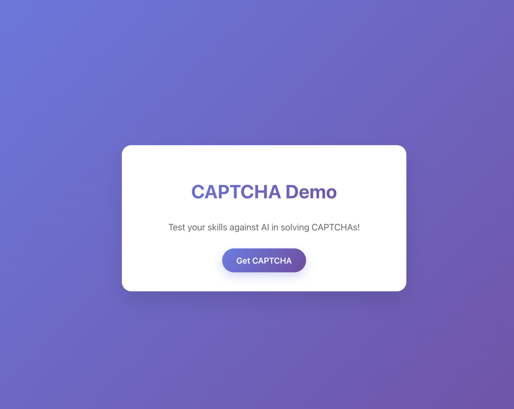
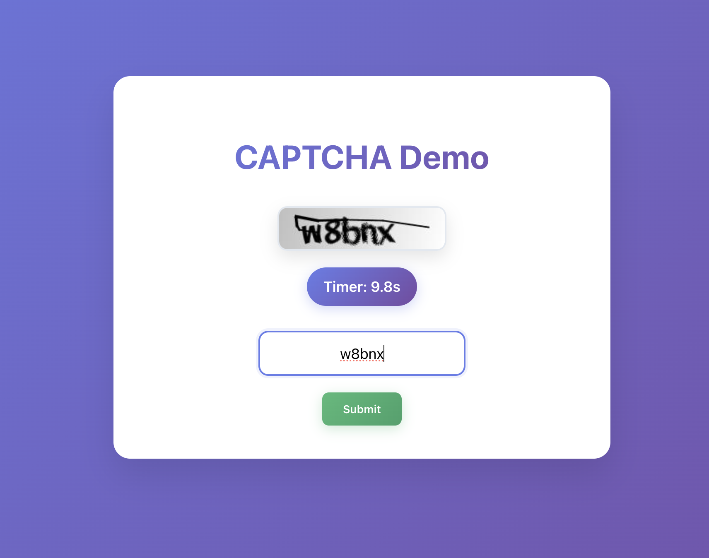
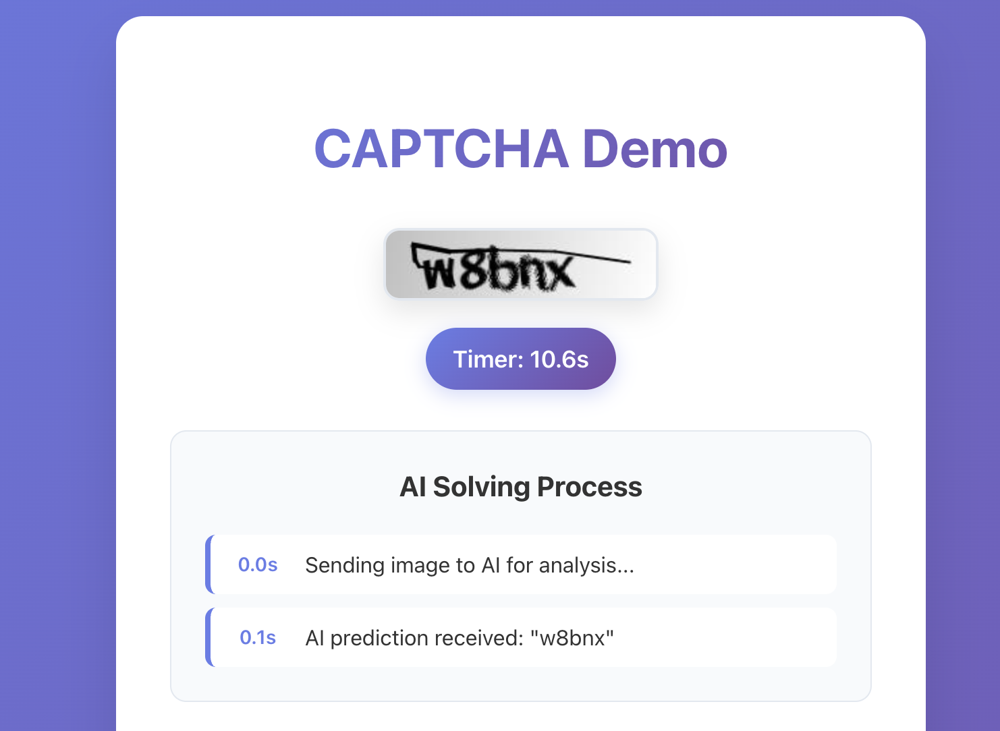
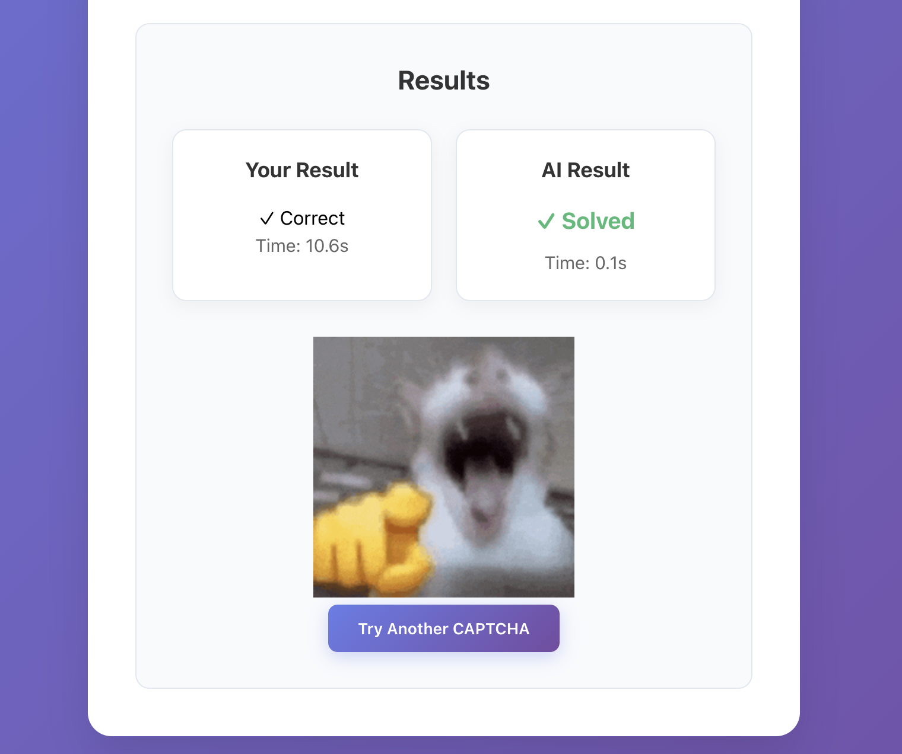

# CSAF Captcha Solving Quiz

Demo created for CPP's 2025 Cybersecurity Fair.

It is a little quiz pitting humans against machine learning models in solving Captchas. The goal is to show how some older captchas methods are becoming obsolete as there are developments the field of machine learning and AI. This has created an arms race in the captcha generation side of things to have them do their intended purpose of keeping bots out of restricted websites.

Character Recognition OCR Model created using TensorFlow and trained on Google Colab. The backend FastAPI endpoint with the model loaded is being hosted via HuggingFace Spaces.

To access, navigate to https://aziac.github.io/csaf-captcha/

# Development

- Clone git repo locally
- Run npm install to install necessary packages
- npm run dev to test via localhost
- npm run deploy to redeploy changes to github pages
